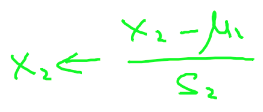

#### Cost Function

* Octave
```Matlab
function J = computeCost (X, y, theta)
    m = size(X, 1);                  % number of training examples
    predictions = X*theta;           % predictions of hypothesis
    sqrErrors = (predictions-y).^2;  % squared errors
    J = 1/(2*m) * sum(sqrErrors);
end
```

* Python
```python
def computeCost(X, y, theta):
    m = y.size                        # number of training examples
    predictions = X.dot(theta)        # predictions of hypothesis
    sqErrors = (predictions - y) ** 2 # squared errors
    J = (1.0 / (2 * m)) * sqErrors.sum()
    return J
```


### Gradient Descent

* Octave
```Matlab
    function [Min, J_history] = gradientDescent(
      X,
      y,
      theta,
      alpha,
      num_of_iter
    );
      m = size(X,1);
      % theta_history = zeros(num_of_iter, 1);
      for i=1:num_of_iter,
        theta = theta - (alpha/m *  (X * theta-y)' * X)';
        % theta_history(i) = theta;
      end;
      Min = theta;
      % J_history = zeros(num_of_iter, 1);
      % J_history = theta_history;
    end
```
* Python
```python
    def gradientDescent(X, y, theta, alpha, num_iters):
      m = y.size
      J_history = np.zeros(shape=(num_iters, 1))
      for i in range(num_iters):
        predictions = X.dot(theta)
        errors = (predictions - y) * X 
        theta = (theta.T - alpha * (1.0 / m) * errors.sum(axis=0)).T
        J_history[i, 0] = computeCost(X, y, theta)

	return theta, J_history
```


### Normal Equation

* Octave
```Matlab
	todo
```
* Python
```python
	todo
```


### Cost Function Multi
* Octave
```Matlab
	todo
```
* Python
```python
	todo
```

### Feature Normalize

* Octave
```Matlab
    function output = featureNormalize (input)
      myMean = mean(input);
      myStd = std(input);
      output = (input - myMean)/myStd;
    end
```
* Python
```python
    def featureNormalize(X):
      mean = np.mean(X, axis=0)
      std = np.std(X, axis=0, ddof=1)
      return (X - mean)/std
```